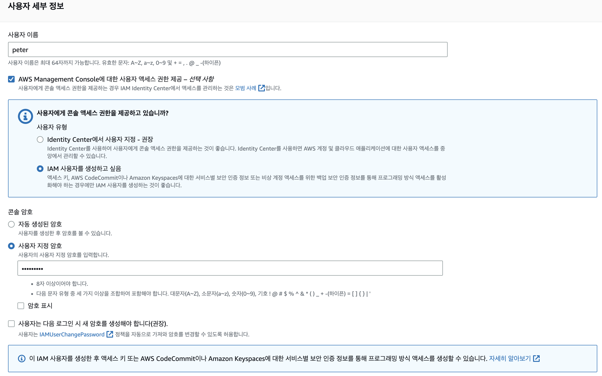
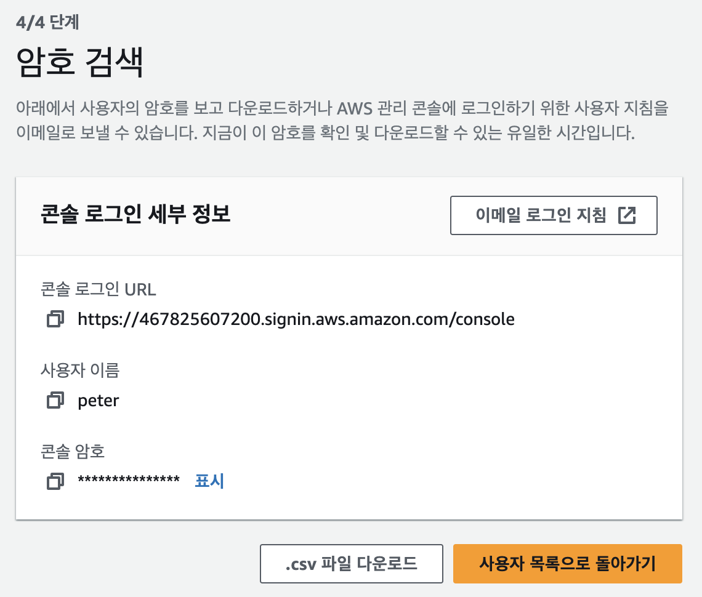
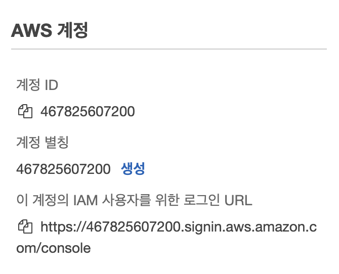

# 02 IAM Section

### IAM: Users & Groups

- IAM = Identity and Access Management, Global service
- Root account created by default, **shouldn't be used or shared**
- Users are people within your organization, and can be grouped
  - Groups only contain users, **not other groups**
  - user can belong to multiple groups

### IAM: Permissions

- Users or Groups can be assigned JSON documents called policies
- In AWS you apply the least privilege principle : 최소한의 권한만 부여
- IAM does not require region selection
- root 계정은 모든 권한이 있기 때문에 위험해서 IAM 계정을 만들어서 사용하는 게 좋음

> 사용자 생성







- URL을 통해 IAM 사용자 로그인 가능

### IAM Policies inheritance

 ```json
 {
   "Version": "2012-10-17",
   "Id": "S3-Account-Permissions",
   "Statement": [
     {
       "Sid": "1",
       "Effect": "Allow",
       "Principal": {
         "AWS": ["arn:aws:iam::123456789012:root"]
       },
       "Action": [
         "s3:GetObject",
         "s3:PutObject"
       ],
       "Resource": ["arn:aws:s3:::mybucket/*"]
     }
   ]
 }
 ```

- Version: 정책 언어 버전 보통 2012-10-17
- Id: 정책 식별자 (선택)
- Statement: one or more individual statements (필수)
  - Sid: 문장 식별자 (선택)
  - Effect: 접근 허용 or 거부
  - Principal: 정책 적용 주체
  - Action: 행위
  - Rescource: action이 적용될 리소스
  - Condition: 적용될 시점