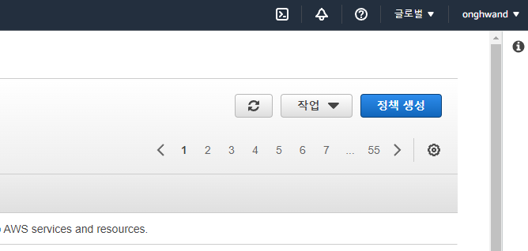
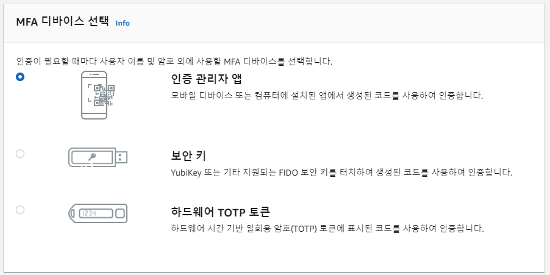
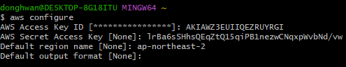
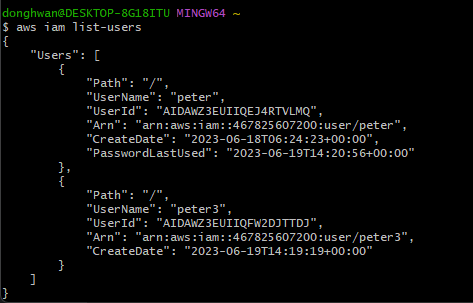
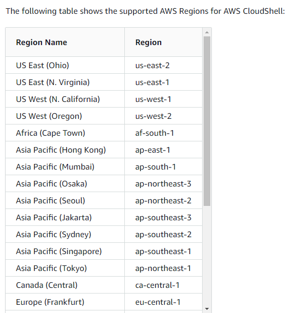
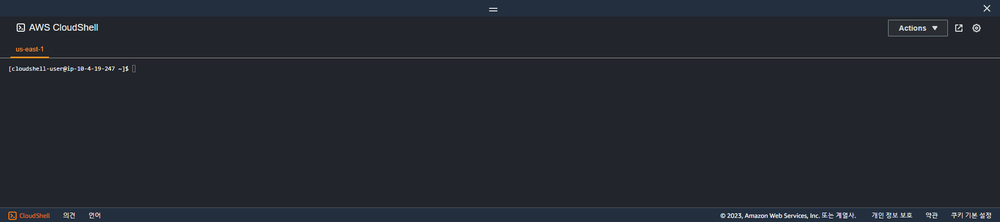
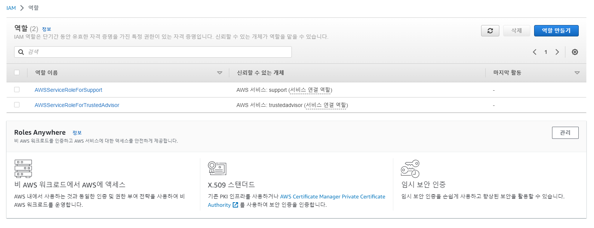
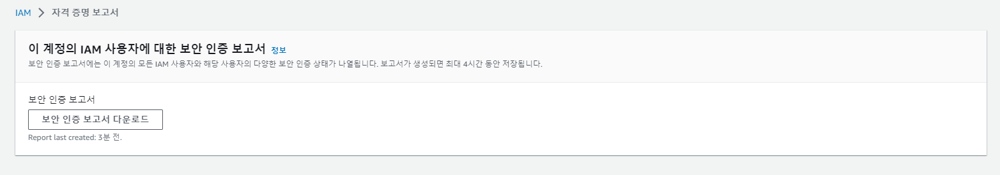
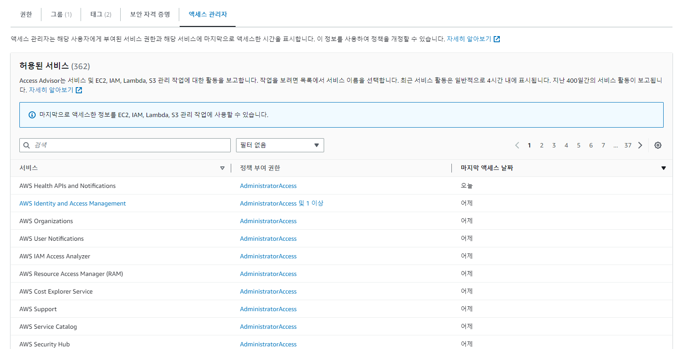

# 02 IAM Section

### IAM: Users & Groups

- IAM = Identity and Access Management, Global service
- Root account created by default, **shouldn't be used or shared**
- Users are people within your organization, and can be grouped
  - Groups only contain users, **not other groups**
  - user can belong to multiple groups

### IAM: Permissions

- Users or Groups can be assigned JSON documents called policies
- In AWS you apply the least privilege principle : 최소한의 권한만 부여
- IAM does not require region selection
- root 계정은 모든 권한이 있기 때문에 위험해서 IAM 계정을 만들어서 사용하는 게 좋음

> 사용자 생성


- URL을 통해 IAM 사용자 로그인 가능

### IAM Policies inheritance

 ```json
 {
   "Version": "2012-10-17",
   "Id": "S3-Account-Permissions",
   "Statement": [
     {
       "Sid": "1",
       "Effect": "Allow",
       "Principal": {
         "AWS": ["arn:aws:iam::123456789012:root"]
       },
       "Action": [
         "s3:GetObject",
         "s3:PutObject"
       ],
       "Resource": ["arn:aws:s3:::mybucket/*"]
     }
   ]
 }
 ```

- Version: 정책 언어 버전 보통 2012-10-17
- Id: 정책 식별자 (선택)
- Statement: one or more individual statements (필수)
  - Sid: 문장 식별자 (선택)
  - Effect: 접근 허용 or 거부
  - Principal: 정책 적용 주체
  - Action: 행위
  - Rescource: action이 적용될 리소스
  - Condition: 적용될 시점
- `정책 생성` 을 통해 정책 직접 생성 가능




### IAM - Password Policy

- you can setup a password policy (min length, specific character types...)
- Multi Factor Authentication - MFA
  - password you know + security device you own
  - device options in AWS 
    - Virtual: Google Authenticator, Authy
    - Physical: Universal 2nd Factor Security Key, Hardware Key Fob




### How can users access AWS?

a. AWS Management Console: password + MFA

b. AWS Command Line Interface: access keys

- access key 입력



- CLI 사용 가능



c. AWS Software Developer Kit: access keys


### AWS CloudShell


- 우측 상단 맨 왼쪽 `>.` 
  - 사용이 불가능한 리전도 있어서 확인 필요
  - [가능 리전 리스트](https://docs.aws.amazon.com/cloudshell/latest/userguide/supported-aws-regions.html)






### IAM Roles for Services

- Some AWS Service will need to perform actions on your behalf
  - To do so, we will assign permissions to AWS Services with IAM Roles
- Common roles:
  - EC2 Instance Roles
  - Lambda Function Roles
  - Roles for CloudFormation



- 역할 만들기를 통해 역할 생성 가능


### Credential report & Access Advisor

주목해야 하는 사용자 or 최소권한 원칙을 지키기 위해 모니터링 가능

- Credential report



- Access Advisor




### IAM Guidelines & Best Practices

- Don't use the root account except for AWS account setup
- Assign users to groups and assign permissions to groups
- Use and enforce the use of MFA
- Create and use Roles for giving permissions to AWS services
- Use Access Keys for Programmatic Access (CLI / SDK)
- Audit permissions of your account with the IAM Credentials Report